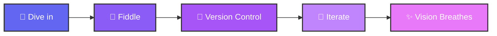

```
 _          _       _                   _          _            _       _     _          _          
/\ \    _ / /\     / /\                /\ \       /\ \         / /\    / /\  /\ \       /\ \     _  
\ \ \  /_/ / /    / /  \              /  \ \     /  \ \____   / / /   / / /  \ \ \     /  \ \   /\_\
 \ \ \ \___\/    / / /\ \            / /\ \ \   / /\ \_____\ / /_/   / / /   /\ \_\   / /\ \ \_/ / /
 / / /  \ \ \   / / /\ \ \          / / /\ \_\ / / /\/___  // /\ \__/ / /   / /\/_/  / / /\ \___/ / 
 \ \ \   \_\ \ / / /  \ \ \        / / /_/ / // / /   / / // /\ \___\/ /   / / /    / / /  \/____/  
  \ \ \  / / // / /___/ /\ \      / / /__\/ // / /   / / // / /\/___/ /   / / /    / / /    / / /   
   \ \ \/ / // / /_____/ /\ \    / / /_____// / /   / / // / /   / / /   / / /    / / /    / / /    
    \ \ \/ // /_________/\ \ \  / / /\ \ \  \ \ \__/ / // / /   / / /___/ / /__  / / /    / / /     
     \ \  // / /_       __\ \_\/ / /  \ \ \  \ \___\/ // / /   / / //\__\/_/___\/ / /    / / /      
      \_\/ \_\___\     /____/_/\/_/    \_\/   \/_____/ \/_/    \/_/ \/_________/\/_/     \/_/       
                                                                                                    
```

<div align="center">
  <!-- Glowing header with custom styling -->
  <h1 style="
    background: linear-gradient(45deg, #6366f1, #8b5cf6, #d946ef);
    -webkit-background-clip: text;
    -webkit-text-fill-color: transparent;
    background-clip: text;
    font-size: 3em;
    margin: 20px 0;
    text-shadow: 0 0 30px rgba(99, 102, 241, 0.5);
  ">VARDHIN</h1>
  
  <p style="
    color: #a1a1aa;
    font-style: italic;
    font-size: 1.2em;
    margin-bottom: 30px;
    text-shadow: 0 2px 4px rgba(0,0,0,0.3);
  ">Code Artist & Dream Architect</p>
</div>

<!-- Custom animated SVG -->
<div align="center">
  <svg width="600" height="200" viewBox="0 0 600 200">
    <defs>
      <linearGradient id="textGradient" x1="0%" y1="0%" x2="100%" y2="0%">
        <stop offset="0%" style="stop-color:#6366f1"/>
        <stop offset="50%" style="stop-color:#8b5cf6"/>
        <stop offset="100%" style="stop-color:#d946ef"/>
      </linearGradient>
      <filter id="glow">
        <feGaussianBlur stdDeviation="3" result="coloredBlur"/>
        <feMerge>
          <feMergeNode in="coloredBlur"/>
          <feMergeNode in="SourceGraphic"/>
        </feMerge>
      </filter>
    </defs>
    
    <text x="300" y="100" text-anchor="middle" font-size="40" font-weight="bold" 
          fill="url(#textGradient)" filter="url(#glow)">
      Code Artist & Dream Architect
      <animate attributeName="opacity" values="0.7;1;0.7" dur="3s" repeatCount="indefinite"/>
    </text>
  </svg>
</div>

<!-- Animated gradient divider -->
<div style="
  height: 4px;
  background: linear-gradient(90deg, transparent, #6366f1, #8b5cf6, #d946ef, transparent);
  margin: 40px 0;
  border-radius: 2px;
  animation: pulse 2s infinite;
"></div>

<!-- Floating project cards -->
<div style="
  display: flex;
  gap: 20px;
  margin: 30px 0;
  flex-wrap: wrap;
  justify-content: center;
">
  <div style="
    background: linear-gradient(135deg, #1e1b4b 0%, #312e81 100%);
    border: 2px solid #6366f1;
    border-radius: 15px;
    padding: 25px;
    width: 300px;
    box-shadow: 0 8px 32px rgba(99, 102, 241, 0.3);
    transition: transform 0.3s ease, box-shadow 0.3s ease;
  " onmouseover="this.style.transform='translateY(-10px)'; this.style.boxShadow='0 15px 50px rgba(99, 102,241, 0.5)'" 
     onmouseout="this.style.transform='translateY(0)'; this.style.boxShadow='0 8px 32px rgba(99, 102, 241, 0.3)'">
    
    <h3 style="color: #f8fafc; margin-bottom: 15px;">🔐 Recon</h3>
    <p style="color: #cbd5e1; line-height: 1.6;">Truly decentralized messaging where your data belongs to you</p>
    
  </div>
</div>

<!-- Neon skill badges -->
<div align="center" style="margin: 40px 0;">
  <span style="
    display: inline-block;
    background: #0f172a;
    color: #ff3e00;
    padding: 8px 16px;
    margin: 5px;
    border: 2px solid #ff3e00;
    border-radius: 25px;
    font-weight: bold;
    text-shadow: 0 0 10px #ff3e00;
    box-shadow: 0 0 20px rgba(255, 62, 0, 0.3);
  ">Svelte</span>
  
  <span style="
    display: inline-block;
    background: #0f172a;
    color: #339933;
    padding: 8px 16px;
    margin: 5px;
    border: 2px solid #339933;
    border-radius: 25px;
    font-weight: bold;
    text-shadow: 0 0 10px #339933;
    box-shadow: 0 0 20px rgba(51, 153, 51, 0.3);
  ">Node.js</span>
</div>

<!-- Animated background container -->
<div style="
  position: relative;
  background: linear-gradient(45deg, #0f172a, #1e1b4b, #312e81);
  border-radius: 20px;
  padding: 30px;
  margin: 30px 0;
  overflow: hidden;
  border: 1px solid #6366f1;
">
  <div style="
    position: absolute;
    top: -50%;
    left: -50%;
    width: 200%;
    height: 200%;
    background: radial-gradient(circle, rgba(99, 102, 241, 0.1) 0%, transparent 70%);
    animation: rotate 20s linear infinite;
  "></div>
  
  <div style="position: relative; z-index: 1;">
    <h2 style="color: #f8fafc; text-align: center;">✨ My Philosophy</h2>
    <p style="color: #cbd5e1; text-align: center; font-size: 1.1em;">
      The journey is everything. I don't just write code; I craft experiences that have soul.
    </p>
  </div>
</div>

<style>
@keyframes pulse {
  0%, 100% { opacity: 1; }
  50% { opacity: 0.5; }
}

@keyframes rotate {
  from { transform: rotate(0deg); }
  to { transform: rotate(360deg); }
}
</style>

##  Who Am I?

I'm someone who sees code as sculpture and pixels as poetry. I dive headfirst into the unknown, treating mountains like haybales and turning wild ideas into living, breathing experiences.

**Currently obsessing over:** Agentic AI and pushing LLM boundaries - converting quadratic complexities to sub-quadratic, building AI pipelines that actually make sense, and exploring ways to make current architectures sing.

**My philosophy:** The journey is everything. I don't just write code; I craft experiences that have soul.


<br>

---

<h2> What I've Built That Actually Matters</h2>

<table>
<tr>
<td width="50%">

### 🔐 **Recon** - Truly Decentralized Messaging
A messaging app where your data belongs to **you** and only you. Built with:
- **GunDB** for decentralized data
- **WebTorrent** for peer-to-peer magic  
- **Svelte** frontend (because React is overrated)
- **Patent published** for the architecture

It's still evolving, but it's my pride and joy - true privacy without compromises.

</td>
<td width="50%">

### 🌌 **My Portfolio** - [vardhin.tech](https://vardhin.tech)
Custom GLSL shaders simulating realistic clouds, sky, sun, moon, and twinkling stars. Light/dark mode? Just drag the sun across the sky like controlling time itself. Because why settle for a toggle when you can have magic?

</td>
</tr>
</table>

---

<h2> My Arsenal (Things I Actually Use)</h2>

<div align="center">


</div>

<details>
<summary><b>📊 Complete Tech Stack</b></summary>

**Frontend:** Svelte (my beloved), custom shaders, anything that lets me paint pixels  
**Backend:** Node.js, Python FastAPI (for AI stuff)  
**Web3:** GunDB, Ethereum via Hardhat/Ganache  
**Mobile:** React Native Expo (simple), Kotlin (when I need power)  
**Languages I Speak:** Telugu (mother tongue ❤️), English, Hindi, Tamil (learning), Japanese (dabbling)  
**OS:** Arch Linux + Hyprland (because customization is life)

**What I fukin hate:** Cloud services! Cloud my dear arch nemesis. If it can't run locally or peer-to-peer, I'm not interested man.

</details>

---

<h2> Beyond Code</h2>

<table>
<tr>
<td width="25%" align="center">

<br><small>I write poems and stories, then build RPG games to bring them to life</small>
</td>
<td width="25%" align="center">

<br><small>Creating melodies when words aren't enough</small>
</td>
<td width="25%" align="center">

<br><small>Understanding what makes humans tick</small>
</td>
<td width="25%" align="center">

<br><small>Optimistically charging ahead, using setbacks as a sculptor's chisel</small>
</td>
</tr>
</table>

**Current linguistic adventure:** Learning Tamil, because every language is a new way to think, and damn this unlocked a horizon for me.

---

<h2> My Approach</h2>

<div align="center">



</div>

I don't "struggle" with problems - I see challenges as haybales, not mountains. I:
1. **Dive in** without knowing everything
2. **Fiddle** until it clicks  
3. **Version control** my journey
4. **Iterate** until my vision breathes

**Learning style:** Hands-on chaos. Break things, fix them, learn by doing.

---

<h2> Let's Create Something Beautiful</h2>

<div align="center">

I'm always looking for passionate souls to build amazing things with. Skill level doesn't matter - passion does.

[](mailto:suryavardhin@gmail.com)
[](https://github.com/vardhin)
[](https://vardhin.tech)

</div>

---

<div align="center">


<br><br>

*"Whatever I do, I put my soul into it. Code isn't just logic - it's poetry that's alive, dreams that live."*


</div>
