```
 _          _       _                   _          _            _       _     _          _          
/\ \    _ / /\     / /\                /\ \       /\ \         / /\    / /\  /\ \       /\ \     _  
\ \ \  /_/ / /    / /  \              /  \ \     /  \ \____   / / /   / / /  \ \ \     /  \ \   /\_\
 \ \ \ \___\/    / / /\ \            / /\ \ \   / /\ \_____\ / /_/   / / /   /\ \_\   / /\ \ \_/ / /
 / / /  \ \ \   / / /\ \ \          / / /\ \_\ / / /\/___  // /\ \__/ / /   / /\/_/  / / /\ \___/ / 
 \ \ \   \_\ \ / / /  \ \ \        / / /_/ / // / /   / / // /\ \___\/ /   / / /    / / /  \/____/  
  \ \ \  / / // / /___/ /\ \      / / /__\/ // / /   / / // / /\/___/ /   / / /    / / /    / / /   
   \ \ \/ / // / /_____/ /\ \    / / /_____// / /   / / // / /   / / /   / / /    / / /    / / /    
    \ \ \/ // /_________/\ \ \  / / /\ \ \  \ \ \__/ / // / /   / / /___/ / /__  / / /    / / /     
     \ \  // / /_       __\ \_\/ / /  \ \ \  \ \___\/ // / /   / / //\__\/_/___\/ / /    / / /      
      \_\/ \_\___\     /____/_/\/_/    \_\/   \/_____/ \/_/    \/_/ \/_________/\/_/     \/_/       
                                                                                                    
```

<div align="center">


<p><i>To code is to make art, art that breathes, art that moves, and art that lives on</i></p>


</div>

<table>
<tr>
<td width="50%">

##  Who Am I?

I'm someone who sees code as sculpture and pixels as poetry. I dive headfirst into the unknown, treating mountains like haybales and turning wild ideas into living, breathing experiences.

**Currently obsessing over:** Agentic AI and pushing LLM boundaries - converting quadratic complexities to sub-quadratic, building AI pipelines that actually make sense, and exploring ways to make current architectures sing.

**My philosophy:** The journey is everything. I don't just write code; I craft experiences that have soul.

</td>
<td width="50%">

<div align="center">


[](https://github.com/vardhin)

<br><br>

*Building the future, one pixel at a time*

</div>

</td>
</tr>
</table>

<br>

---

<h2> What I've Built That Actually Matters</h2>

<table>
<tr>
<td width="50%">

### 🔐 **Recon** - Truly Decentralized Messaging
A messaging app where your data belongs to **you** and only you. Built with:
- **GunDB** for decentralized data
- **WebTorrent** for peer-to-peer magic  
- **Svelte** frontend (because React is overrated)
- **Patent published** for the architecture

It's still evolving, but it's my pride and joy - true privacy without compromises.

</td>
<td width="50%">

### 🌌 **My Portfolio** - [vardhin.tech](https://vardhin.tech)
Custom GLSL shaders simulating realistic clouds, sky, sun, moon, and twinkling stars. Light/dark mode? Just drag the sun across the sky like controlling time itself. Because why settle for a toggle when you can have magic?

</td>
</tr>
</table>

---

<h2> My Arsenal (Things I Actually Use)</h2>

<div align="center">


</div>

<details>
<summary><b>📊 Complete Tech Stack</b></summary>

**Frontend:** Svelte (my beloved), custom shaders, anything that lets me paint pixels  
**Backend:** Node.js, Python FastAPI (for AI stuff)  
**Web3:** GunDB, Ethereum via Hardhat/Ganache  
**Mobile:** React Native Expo (simple), Kotlin (when I need power)  
**Languages I Speak:** Telugu (mother tongue ❤️), English, Hindi, Tamil (learning), Japanese (dabbling)  
**OS:** Arch Linux + Hyprland (because customization is life)

**What I fukin hate:** Cloud services! Cloud my dear arch nemesis. If it can't run locally or peer-to-peer, I'm not interested man.

</details>

---

<h2> Beyond Code</h2>

<table>
<tr>
<td width="25%" align="center">

<br><small>I write poems and stories, then build RPG games to bring them to life</small>
</td>
<td width="25%" align="center">

<br><small>Creating melodies when words aren't enough</small>
</td>
<td width="25%" align="center">

<br><small>Understanding what makes humans tick</small>
</td>
<td width="25%" align="center">

<br><small>Optimistically charging ahead, using setbacks as a sculptor's chisel</small>
</td>
</tr>
</table>

**Current linguistic adventure:** Learning Tamil, because every language is a new way to think, and damn this unlocked a horizon for me.

---

<h2> My Approach</h2>

<div align="center">



</div>

```mermaid
graph LR
    A[🎯 Dive in] --> B[🔧 Fiddle]
    B --> C[📝 Version Control]
    C --> D[🔄 Iterate]
    D --> E[✨ Vision Breathes]
    
    style A fill:#6366f1,stroke:#333,stroke-width:2px,color:#fff
    style B fill:#8b5cf6,stroke:#333,stroke-width:2px,color:#fff
    style C fill:#a855f7,stroke:#333,stroke-width:2px,color:#fff
    style D fill:#c084fc,stroke:#333,stroke-width:2px,color:#fff
    style E fill:#e879f9,stroke:#333,stroke-width:2px,color:#fff
```

I don't "struggle" with problems - I see challenges as haybales, not mountains. I:
1. **Dive in** without knowing everything
2. **Fiddle** until it clicks  
3. **Version control** my journey
4. **Iterate** until my vision breathes

**Learning style:** Hands-on chaos. Break things, fix them, learn by doing.

---

<h2> Let's Create Something Beautiful</h2>

<div align="center">

I'm always looking for passionate souls to build amazing things with. Skill level doesn't matter - passion does.

[](mailto:suryavardhin@gmail.com)
[](https://github.com/vardhin)
[](https://vardhin.tech)

</div>

---

<div align="center">


<br><br>

*"Whatever I do, I put my soul into it. Code isn't just logic - it's poetry that's alive, dreams that live."*


</div>
